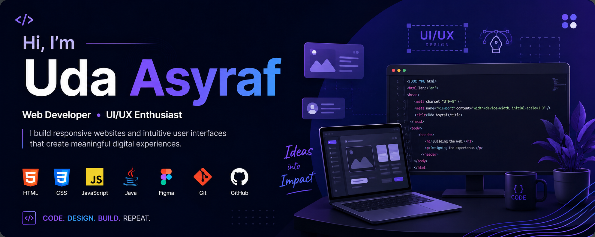

## 👋 Hi, I'm Uda Asyraf

### 💻 Web Developer | 🎨 UI/UX Enthusiast

Welcome to my GitHub profile!

I'm **Uda Asyraf**, a student who is interested in **web development and UI/UX design**. I enjoy learning new technologies, designing user-friendly interfaces, and turning ideas into functional digital experiences.

I'm currently developing my skills through academic projects, personal projects, and continuous exploration of web technologies.

---

## 🛠️ Skills & Tech Stack

### 💻 Programming & Web Development

### 🎨 UI/UX Design

### 🔧 Tools

---

## 📊 GitHub Stats

  

---

## 🌐 Connect With Me

  
  

---

## ✨ Fun Facts

* 🎨 I enjoy creating and exploring UI/UX designs.
* 💻 I like turning ideas into websites and digital projects.
* 🧩 I enjoy learning new technologies through hands-on projects.
* 🚀 Always learning, building, and improving.

---

## 💬 Quote

> *"Every expert was once a beginner."*

---

### 🚀 Thanks for visiting my profile!

**Keep learning. Keep building. Keep improving.**

## Hi there 👋

<!--
**tukdalanglapuk/tukdalanglapuk** is a ✨ _special_ ✨ repository because its `README.md` (this file) appears on your GitHub profile.

Here are some ideas to get you started:

- 🔭 I’m currently working on ...
- 🌱 I’m currently learning ...
- 👯 I’m looking to collaborate on ...
- 🤔 I’m looking for help with ...
- 💬 Ask me about ...
- 📫 How to reach me: ...
- 😄 Pronouns: ...
- ⚡ Fun fact: ...
-->
